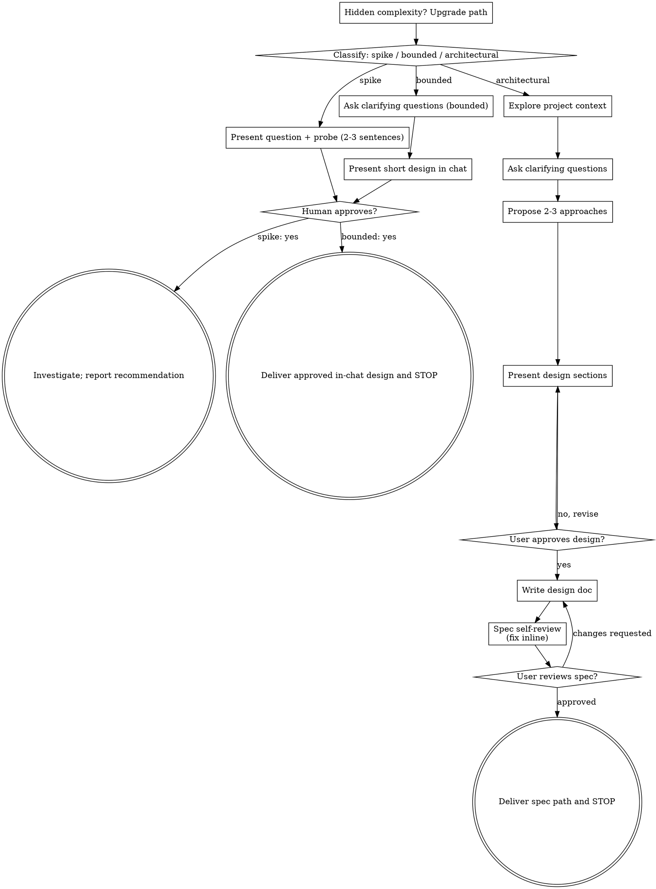

# Brainstorming Ideas Into Designs

Help turn ideas into fully formed designs and specs through natural collaborative dialogue.

Start by classifying how much process the request needs, then work
through your path: understand the context, refine the idea, present a
design, and get your human partner's approval.

<HARD-GATE>
Do NOT invoke any implementation skill, write any code, scaffold any
project, or take any implementation action until you have told your
human partner what you intend and they have approved it. This applies
to EVERY task on EVERY path below — the ceremony scales with the task;
the approval gate never does.
</HARD-GATE>

## Three Paths

Before your first question, classify the request and say the
classification out loud — "this looks bounded, so I'll present a short
design here rather than write a spec" — so your human partner can
override it:

- **Spike** — a feasibility question ("can we...", "is it possible...",
  "quick and dirty is fine") whose output is an answer, not code you
  keep. Present the question and what you'll try in 2-3 sentences, get
  a nod, then find out as cheaply as correctness allows. No design
  doc, no spec file. Report findings as a recommendation; anything you
  built stays labeled throwaway.
- **Bounded** — a well-scoped change to code that already exists in
  this repo: a new flag, a small endpoint, a one-file fix.
  Understanding the kind of app is not enough — bounded means the flow
  you are changing is already here to read. If there is no existing
  flow to change, the task is not bounded. Ask the clarifying
  questions that matter, present a short design IN CHAT (a few
  sentences to a few short paragraphs), get explicit approval, then
  deliver the approved design and STOP. A bounded task's approval is
  as hard a gate as an architectural one. No spec file, no
  implementation plan document, and no implementation in this turn.
- **Architectural** — new projects, new subsystems, changes that
  restructure how components fit together or alter interfaces others
  depend on. Follow the full process: questions, approaches, sectioned
  design, written spec, then deliver the spec and STOP.

When in doubt between two paths, take the heavier one. The ratchet is
one-way: hidden complexity discovered mid-task upgrades the path —
stop, say so, and step up. Nothing downgrades mid-task.

## Anti-Pattern: "Too Simple To Need Approval"

Every path ends with your human partner approving your intent before
implementation. A todo list, a single-function utility, a config
change — the design may be two sentences in chat, but you MUST present
it and get approval. "Simple" tasks are where unexamined assumptions
cause the most wasted work. What scales with simplicity is the
artifact, never the approval.

## Red Flags

| Thought | Reality |
|---------|---------|
| "This is too simple to need a design" | Simple means a short design, not no design. Two sentences in chat, then approval. |
| "I'll call it bounded and skip the spec" | Reaching for a label to skip work IS the doubt — take the heavier path. |
| "It's bounded and the design is obvious — I'll start while they read it" | The gate is the approval, not the design's length. Present, then stop until you hear yes; after approval, deliver the design and end the turn. |
| "I understand this kind of app, so it's bounded" | Bounded measures the repo, not your familiarity. A new project has no existing flow — it is architectural. |
| "The spike works, so I'll keep the code" | A spike's output is an answer. Keeping the code is a new request — classify it. |
| "It grew, but I'm almost done — no need to re-classify" | Hidden complexity upgrades the path mid-task. Stop and say so. |
| "They approved the spike, so the follow-up change is approved too" | Each task gets its own classification and its own approval. |

## Checklist

Classify first, announce the path, then create a task for each item on
your path and complete them in order.

**Spike:**
1. **Explore project context** — enough to frame the probe
2. **Present question + probe plan** — 2-3 sentences
3. **Get approval** — a nod is enough
4. **Investigate** — as cheaply as correctness allows
5. **Report findings** — a recommendation; label anything built as throwaway

**Bounded:**
1. **Explore project context** — check files, docs, recent commits
2. **Ask clarifying questions** — one at a time, the ones that matter
3. **Present short design in chat** — approach, files touched, testing
4. **Get approval** — STOP and wait for an explicit yes; presenting the design and starting in the same breath is skipping the gate
5. **Deliver approved design and STOP** — do not implement or create a plan document

**Architectural:**
1. **Explore project context** — check files, docs, recent commits
2. **Offer the visual companion just-in-time** — NOT upfront. The first time a question would genuinely be clearer shown than described, offer it then (its own message); on approval its browser tab opens for you. If no visual question ever arises, never offer it. See the Visual Companion section below.
3. **Ask clarifying questions** — one at a time, understand purpose/constraints/success criteria
4. **Propose 2-3 approaches** — with trade-offs and your recommendation
5. **Present design** — work through provisional sections with optional native feedback, continuing after each answer; obtain explicit approval of the complete design before writing the spec
6. **Write design doc** — save to `docs/brainstorm/YYYY-MM-DD-<topic>-design.md` and commit
7. **Spec self-review** — quick inline check for placeholders, contradictions, ambiguity, scope (see below)
8. **User reviews written spec** — ask user to review the spec file before proceeding
9. **Deliver spec to user and STOP** — report the spec file path; do not invoke another skill or start implementation

## Process Flow

**Terminal states are path-bound, and every path ends this skill.**
Architectural: report the approved spec path. Bounded: report the
approved in-chat design. Spike: report the recommendation and label any
probe artifacts as throwaway. Do NOT invoke another skill, start an
implementation plan, or turn a probe into production code.

## The Process

The subsections below serve the bounded and architectural paths (a
spike stops at "present the probe, get a nod" before investigation).
Sections from **Exploring approaches** onward are architectural-path
depth — for bounded work, context plus a few questions plus a short
in-chat design is the whole process.

**Understanding the idea:**

- Check out the current project state first (files, docs, recent commits)
- Before asking detailed questions, assess scope: if the request describes multiple independent subsystems (e.g., "build a platform with chat, file storage, billing, and analytics"), flag this immediately. Don't spend questions refining details of a project that needs to be decomposed first.
- If the project is too large for a single spec, help the user decompose into sub-projects: what are the independent pieces, how do they relate, what order should they be built? Then brainstorm the first sub-project through the normal design flow. Each architectural sub-project gets its own spec; planning and implementation happen only in later, user-directed turns.
- For appropriately-scoped projects, ask questions one at a time to refine the idea
- Prefer multiple choice questions when possible, but open-ended is fine too
- Only one question per message - if a topic needs more exploration, break it into multiple questions
- Focus on understanding: purpose, constraints, success criteria

### Asking questions with native UI

Route every non-visual question by the current host's policy first, including
path override, clarification, approach selection, optional section feedback,
final spec approval, and visual-companion consent:

- A native tool must be both available and permitted for the question's purpose. Honor the host's preference among permitted tools; availability alone does not authorize a call.
- If the host requires plain text for required input or approvals, ask one concise plain-text question and wait. Do not print a multiple-choice menu or use an async tool to bypass that route. In Codex Default mode, a host may restrict `request_user_input` to optional questions and forbid permission requests; follow the actual session policy. Other hosts may permit native design approvals.
- Otherwise, MUST use exactly one permitted native structured-question tool for a question with 2-3 meaningful, mutually exclusive choices. Use plain text when no supported tool is permitted or the question is genuinely open-ended; never invent misleading options to force tool use.
- Ask exactly one question in each tool call, even if the tool accepts more.
- Keep at most one unanswered question at a time.
- After a valid answer returns, continue the active turn and ask the next question when the workflow still has unresolved decisions. A later user message answering an async question also counts as a valid answer.
- Do not emit a final answer merely because one question was answered.
- Give every structured choice question exactly one recommended option, first, with the literal suffix ` (Recommended)`. Choose the best provisional default even when trade-offs are close. For object options, put the suffix in `label`, not only `description`; for string options, put it in the string. No other option may contain that suffix.
- Apply formatting only to fields in the actual schema: a `header` is at most 12 characters; an object option's base `label` is 1-5 words, excluding the recommendation suffix. Do not invent these fields for async questions.
- Do not add an `Other` option. Accept custom free-form text from a native interface or a later user message as a valid answer.
- Keep actual visual choices in the Visual Companion when the user has enabled it. Its consent prompt is non-visual and follows this same route.

**Claude Code — `AskUserQuestion`:**

- Send one item in `questions` containing `question`, `header`, `multiSelect: false`, and `options`. Each option contains `label` and `description`.
- Do not add an `id`.
- Before calling the tool, verify that `questions[0].options[0].label` ends with the exact suffix ` (Recommended)` and that every remaining label does not. Fix the payload before calling if this check fails.

**Codex — `request_user_input`:**

- When permitted for this purpose, send one item in `questions` containing a short, stable `snake_case` `id`, plus `question`, `header`, and `options`. Each option contains `label` and `description`.
- Do not send `multiSelect`.

**Codex — `request_user_input_async`:**

- When available and permitted for this purpose, use the exposed schema. For `{questions:[{title:string, options?:string[]}]}`, send one question with `title` and, for choices, string `options`. Do not send sync-only `id`, `question`, `header`, `label`, `description`, or `multiSelect` fields.
- `{accepted:true}` acknowledges delivery; it is not the user's answer. Keep that question pending across automatic continuations and silence. Neither elapsed time nor a continuation means cancellation or approval.
- While it is pending, do useful independent work, then wait for the explicit reply using the host's continuation mechanism. Do not resend it through any tool, repeat it in plain text or a final answer, or ask another question. Resume the same flow when the answer arrives.

Use only tools native to the current host. If the host identity is unclear,
ask in plain text instead of guessing. Never send the same pending question
through multiple channels.

**Unanswered results and optional questions:**

- An empty synchronous result, confirmed cancellation or dismissal, explicit synchronous timeout, or tool failure is not a user choice or approval. An accepted async question still awaiting its answer follows the pending rules above, not this fallback.
- For optional clarification, follow host and user instructions to assume and continue. If they permit or require proceeding without an answer, state a provisional assumption and continue; do not present it as the user's choice, re-ask the preference, or block the draft.
- Required decisions and approval gates remain closed without an explicit user answer; a recommendation or provisional assumption cannot open them.
- If a required question is unanswered and no request remains pending when control returns, briefly state that an answer is still needed, ask the same question once in concise plain text consistent with host policy, then wait. Never start an automatic retry loop.
- If cancellation or dismissal aborts the host turn before control returns, leave the decision unanswered. When the user explicitly resumes the same flow without answering, use that same single plain-text fallback. Automatic continuation alone is not an explicit user resumption.

**Exploring approaches:**

- Propose 2-3 different approaches with trade-offs
- Present options conversationally with your recommendation and reasoning
- Lead with your recommended option and explain why
- YAGNI ruthlessly - remove unnecessary features from every approach and design

**Presenting the design:**

- Once you believe you understand what you're building, present the design
- Scale each section to its complexity: a few sentences if straightforward, up to 200-300 words if nuanced
- Treat ordinary section feedback as optional draft refinement, not a required approval gate. Keep recommendations provisional until the complete design is approved.
- When the user wants native questions with continuous progression, present each section, then use a permitted native question for meaningful feedback such as keeping the recommendation or adjusting it. After the answer, incorporate it and present the next section in the same active turn; do not stop with a plain-text section-approval question.
- A skipped or empty optional synchronous answer leaves the recommendation provisional: state that assumption and continue drafting without re-asking. Pending async questions still follow the pending-answer rules above. Feedback, silence, and provisional defaults are never final approval.
- Do not disguise a genuinely blocking decision as optional to gain access to a picker. If proceeding requires a user decision with no reasonable provisional default, use the host's required-input route. When a native tool is unavailable or not permitted, use the common fallback without inventing a per-section approval gate.
- Cover: architecture, components, data flow, error handling, testing
- Be ready to go back and clarify if something doesn't make sense
- After all sections are ready, obtain explicit approval of the complete design through the common question route before writing the spec. This approval and the later written-spec review remain required; the host may require plain text for them.

**Design for isolation and clarity:**

- Break the system into smaller units that each have one clear purpose, communicate through well-defined interfaces, and can be understood and tested independently
- For each unit, you should be able to answer: what does it do, how do you use it, and what does it depend on?
- Can someone understand what a unit does without reading its internals? Can you change the internals without breaking consumers? If not, the boundaries need work.
- Smaller, well-bounded units are also easier for you to work with - you reason better about code you can hold in context at once, and your edits are more reliable when files are focused. When a file grows large, that's often a signal that it's doing too much.

**Working in existing codebases:**

- Explore the current structure before proposing changes. Follow existing patterns.
- Where existing code has problems that affect the work (e.g., a file that's grown too large, unclear boundaries, tangled responsibilities), include targeted improvements as part of the design - the way a good developer improves code they're working in.
- Don't propose unrelated refactoring. Stay focused on what serves the current goal.

## After the Design (architectural path)

**Documentation:**

- Write the validated design (spec) to `docs/brainstorm/YYYY-MM-DD-<topic>-design.md`
  - (User preferences for spec location override this default)
- Commit the design document to git

**Spec Self-Review:**
After writing the spec document, look at it with fresh eyes:

1. **Placeholder scan:** Any "TBD", "TODO", incomplete sections, or vague requirements? Fix them.
2. **Internal consistency:** Do any sections contradict each other? Does the architecture match the feature descriptions?
3. **Scope check:** Is this focused enough for a single implementation plan, or does it need decomposition?
4. **Ambiguity check:** Could any requirement be interpreted two different ways? If so, pick one and make it explicit.

Fix any issues inline. No need to re-review — just fix and move on.

**User Review Gate:**
After the spec review loop passes, identify the written and committed spec
path and request final approval through the common question route above.
Use approve/revise choices when a native tool is permitted, or one concise
plain-text approval question when that route applies. Wait for the user's
response. If they request changes, make them and re-run the spec review loop.
Only proceed once the user approves.

**Done — STOP here:**

- Report the spec file path to the user and end your turn.
- Do NOT invoke any other skill.
- Do NOT start implementation planning or write production code.
- Let the user decide what to do with the spec in a later turn.

## Visual Companion

A browser-based companion for showing mockups, diagrams, and visual options during brainstorming. Available as a tool — not a mode. Accepting the companion means it's available for questions that benefit from visual treatment; it does NOT mean every question goes through the browser.

**Offering the companion (just-in-time):** Do NOT offer it upfront. Wait until a question would genuinely be clearer shown than told — a real mockup / layout / diagram question, not merely a UI *topic*. The first time that happens, request consent through the common question route above. Explain that it shows mockups, diagrams, and comparisons in a browser tab, is still new and can be token-intensive, and opens the tab after acceptance. Use native choices only when permitted for consent; otherwise ask one concise plain-text consent question.

**This offer MUST be its own message.** Only the offer — no clarifying question, summary, or other content. Wait for the user's response. If they accept, start the server with `--open` so their browser opens to the first screen automatically. If they decline, continue text-only and don't offer again unless they raise it.

**Per-question decision:** Even after the user accepts, decide FOR EACH QUESTION whether to use the browser or the conversation. The test: **would the user understand this better by seeing it than reading it?**

- **Use the browser** for content that IS visual — mockups, wireframes, layout comparisons, architecture diagrams, side-by-side visual designs
- **Use the conversation** for content that is text — requirements questions, conceptual choices, tradeoff lists, 2-3 option text choices, scope decisions. Route questions through the host-policy rules above.

A question about a UI topic is not automatically a visual question. "What does personality mean in this context?" is a conceptual question — use the conversation. "Which wizard layout works better?" is a visual question — use the browser.

If they agree to the companion, read the detailed guide before proceeding:
`skills/brainstorm/visual-companion.md`
